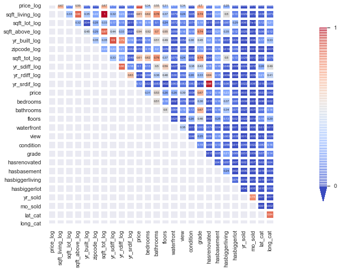
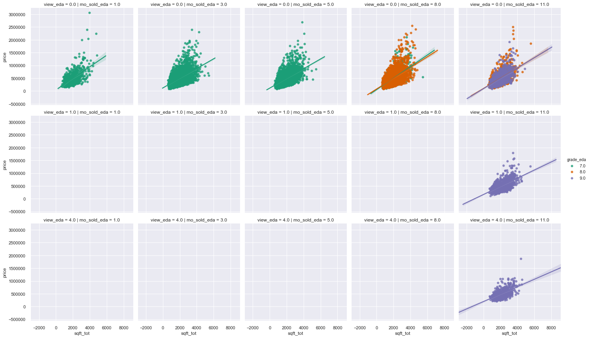
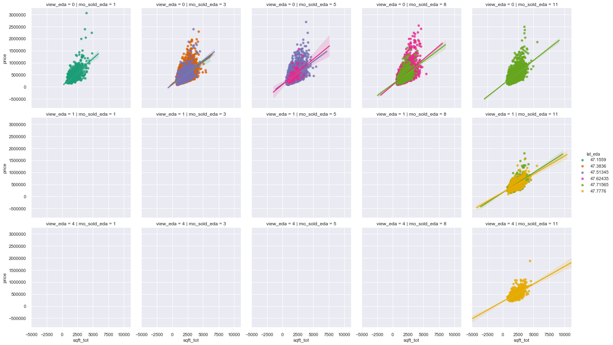

# Seattle Housing Project

## Motivation

I would like to utilize this data to study house buyers' decision-making behaviors, e.g. customer purchase behavior modeling. 

**What're major factors that make impact on house buyers' behaviors?**

* house **location**
   * weather factor
   * maintenance cost
   * daily commute time, road condition and traffic safety
   * neighborhood quality, e.g. ethics, religion, immigration backgrounds, political parties, education level, salary range, career/occupation and ages
   * school district for kid education
   * community life, convenience and entertainment, e.g. close to national state park, fishing, dairy food farms and so on
   * crime rate

* house **condition**
   * when it was built
   * has it ever been renovated?
   * with or without basement?

* house **size**
   * family size
   * above average compared to the neighborhood?
   * house tour evaluation: reliability of votes, e.g. are voters all buyers? or they are simply house tourists?

* house **price**
   * buyer's economic capability
   * buyer's health condition
   * buyer's age range or generation
   * buyer's intension to be a landlord of the house (monthly rental fee)
   * annual tax payment
   * renovation/maintenance expanses included?
   * loan option for specific groups
   * discount deal/offer for specific groups and seasons
   
https://en.wikipedia.org/wiki/Seattle

Coordinates of Seattle WA: 47°36′35″N 122°19′59″W

https://en.wikipedia.org/wiki/History_of_Seattle

### Jupyter Notebook Must-Haves

For this project, my Jupyter Notebook contains the following specifications:

#### Visualizations & EDA

* Question 1: What are influential factors on house tours? 
  - season
  - grade (evaluation)
  - condition
  - location
  - house age
  
  
  
  
  
* Question 2: What are influential factors on house buyers' decision-making behaviors?
* Question 3: What are influential factors on house price?   

#### Model Quality/Approach

* baseline model without dummies
* baseline model with dummies

### Non-Technical Presentation Must-Haves
