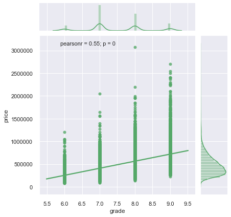
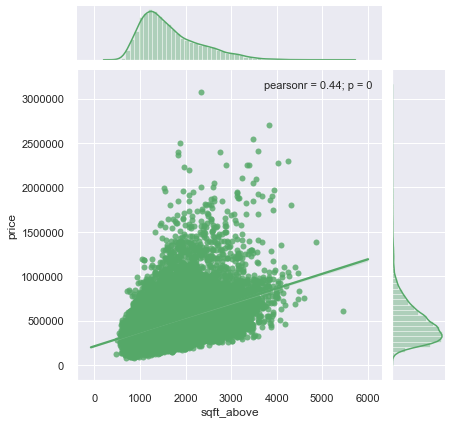

# Seattle Housing Project

# Motivation

I would like to utilize this data to study house buyers' decision-making behaviors, e.g. customer purchase behavior modeling. 

**What're major factors that make impact on house buyers' behaviors?**

* house **location**
   * weather factor
   * maintenance cost
   * daily commute time, road condition and traffic safety
   * neighborhood quality, e.g. ethics, religion, immigration backgrounds, political parties, education level, salary range, career/occupation and ages
   * school district for kid education
   * community life, convenience and entertainment, e.g. close to national state park, fishing, dairy food farms and so on
   * crime rate

* house **condition**
   * when it was built
   * has it ever been renovated?
   * with or without basement?

* house **size**
   * family size
   * above average compared to the neighborhood?
   * house tour evaluation: reliability of votes, e.g. are voters all buyers? or they are simply house tourists?

* house **price**
   * buyer's economic capability
   * buyer's health condition
   * buyer's age range or generation
   * buyer's intension to be a landlord of the house (monthly rental fee)
   * annual tax payment
   * renovation/maintenance expanses included?
   * loan option for specific groups
   * discount deal/offer for specific groups and seasons
   
https://en.wikipedia.org/wiki/Seattle

Coordinates of Seattle WA: 47°36′35″N 122°19′59″W

https://en.wikipedia.org/wiki/History_of_Seattle

---------------------------------------------------------------------------------------------------------------------------------------

For this project, my Jupyter Notebook contains the following specifications:

# Visualizations & EDA

## Question: What are influential factors on house price?

## Question 1: What are influential factors on house tours? 
  - season
  - grade (evaluation)
  - condition
  - location
  - house age
  - house amenities (basement, lot)
  - maintenance (renovation)
  - price
  
    * grade : interior area vs. price
    Over Thanksgiving and Xmas holiday seasons, higher graded houses attract more guests, visitors and buyers for tours.
    
  
    * condition : interior area vs. price
    
  
    * latitude (N/S) : interior area vs. price 
    
  
    * longitude (E/W) : interior area vs. price
    
  
    * renovation : interior area vs. price
    
  
    * basement : interior area vs. price
    
  
    * house age : age vs. price
      - latitude
      
      - longitude
      
      
    * house age : age vs. interior area
      - latitude
      
      - longitude
      
      
### Analysis:

### Recommendations:

### Future Work:
  
## Question 2: What are influential factors on house buyers' decision-making behaviors?
  - view
  - purchase, i.e. house sold months (season)
   
### Analysis:

### Recommendations:

### Future Work:

## Model Quality/Approach

* baseline model without dummies
* baseline model with dummies
