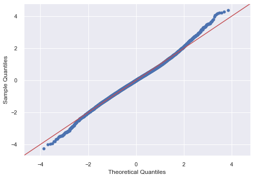

# Seattle Housing Project: Motivation

I would like to utilize this data to study house buyers' decision-making behaviors, e.g. customer purchase behavior modeling.

**What're major factors that make impact on house buyers' behaviors?**

* house **location**
   * weather factor
   * maintenance cost
   * daily commute time, road condition and traffic safety
   * neighborhood quality, e.g. ethics, religion, immigration backgrounds, political parties, education level, salary range, career/occupation and ages
   * school district for kid education
   * community life, convenience and entertainment, e.g. close to national state park, fishing, dairy food farms and so on
   * crime rate

* house **condition**
   * when it was built
   * has it ever been renovated?
   * with or without basement?

* house **size**
   * family size
   * above average compared to the neighborhood?
   * house tour evaluation: reliability of votes, e.g. are voters all buyers? or they are simply house tourists?

* house **price**
   * buyer's economic capability
   * buyer's health condition
   * buyer's age range or generation
   * buyer's intension to be a landlord of the house (monthly rental fee)
   * annual tax payment
   * renovation/maintenance expanses included?
   * loan option for specific groups
   * discount deal/offer for specific groups and seasons
   
https://en.wikipedia.org/wiki/Seattle

https://en.wikipedia.org/wiki/History_of_Seattle

---------------------------------------------------------------------------------------------------------------------------------------

## Model Quality/Approach

* 

*

---------------------------------------------------------------------------------------------------------------------------------------

# Visualizations & EDA

## Question: What are influential factors on house price?

## Question 1: What are influential factors on house tours? 
  - season
  - grade (evaluation)
  - condition
  - location
  - house age
  - house amenities (basement, lot)
  - maintenance (renovation)
  - price
  
    * grade : interior area vs. price
    
    Over *Thanksgiving and Xmas* holiday seasons, **higher graded** houses attract more guests, visitors and buyers for tours.
    
    
  
    * condition : interior area vs. price
    
    Over *Thanksgiving and Xmas* holiday seasons, **well-maintained** houses attract more guests, visitors and buyers for tours.
    
    
  
    * latitude (N/S) : interior area vs. price 
    
    Over *Thanksgiving and Xmas* holiday seasons, houses located at **northern of Seattle** attract more guests, visitors and buyers for tours.
    
    
  
    * longitude (E/W) : interior area vs. price
    
    Over *Thanksgiving and Xmas* holiday seasons, houses located at **eastern of Seattle** attract more guests, visitors and buyers for tours.
    
    
  
    * renovation : interior area vs. price
    
    Renovated houses are **older** than those without renovation, so that they are **not** as attractive as new ones. Moreover, owing to maintenance expense, renovated houses are a bit more pricey than those without additional cost.  
    
    
    
    
  
    * basement : interior area vs. price
    
    Houses with basements are more pricey (because of larger living area) than without. Therefore, they are **not** quite attrative. 
    
    
  
    * house age : age vs. price
    
    owing to the growing population, that accompany with more and more business migration from other cities into Seattle, with years, the need of building more houses for the younger generation of immigrants increases, accordingly. Since the space close to Seattle becomes limited, these newer houses were built radially away from Seattle. Hence, they are closer to either Vancouver, Canada or Idaho, USA. The weather is thus colder and drier.            
    
      - latitude
      
      Houses located at **northern of Seattle** are younger. Newer houses are likely to attract higher condition score and better grade based on the King county grading scale, so that, relatively, they tend to be more pricey than older ones, which were built earlier and closer to Seattle. Despite that, most newer houses were sold at a much cheaper price than older ones, because these younger houses are likely located in the suburban area, i.e. closer to Vancouver or Idaho, and the daily commute might take residents substantial amount of time.   
      
      
      
      Houses located at **eastern of Seattle** are younger. 
      
      - longitude
      
      
    * house age : age vs. interior area 
    
      Generally speaking, younger houses tend to be bigger, but they are still sold at lower prices, because they are located in suburban districts.
    
      - latitude   
      
      
      
      - longitude
      
      
      
### Analysis:

### Recommendations:

### Future Work:
  
## Question 2: What are influential factors on house buyers' decision-making behaviors?
  - view
  - purchase, i.e. house sold months (season)
   
### Analysis:

### Recommendations:

### Future Work:

---------------------------------------------------------------------------------------------------------------------------------------

