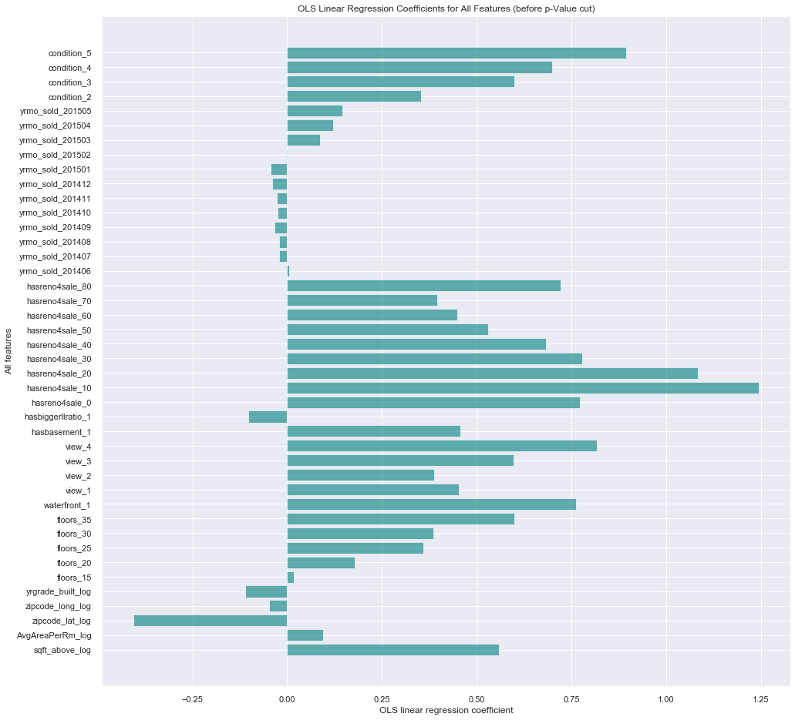
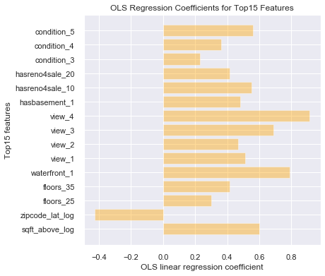
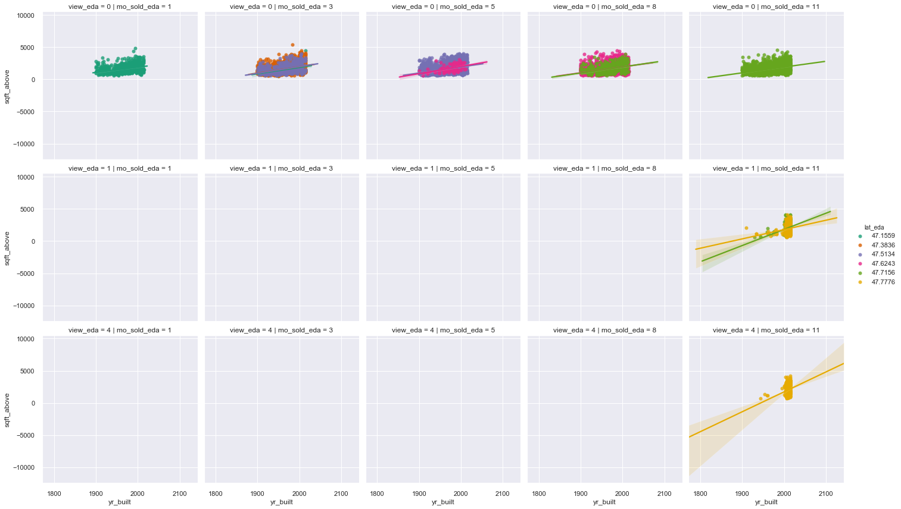

# Seattle Housing Project: Motivation

I would like to utilize this data to study house buyers' decision-making behaviors, e.g. customer purchase behavior modeling.

**What're major factors that make impact on house buyers' behaviors?**

* house **location**
   * weather factor
   * maintenance cost
   * daily commute time, road condition and traffic safety
   * neighborhood quality, e.g. ethics, religion, immigration backgrounds, political parties, education level, salary range, career/occupation and ages
   * school district for kid education
   * community life, convenience and entertainment, e.g. close to national state park, fishing, dairy food farms and so on
   * crime rate

* house **condition**
   * when it was built
   * has it ever been renovated?
   * with or without basement?

* house **size**
   * family size
   * above average compared to the neighborhood?
   * house tour evaluation: reliability of votes, e.g. are voters all buyers? or they are simply house tourists?

* house **price**
   * buyer's economic capability
   * buyer's health condition
   * buyer's age range or generation
   * buyer's intension to be a landlord of the house (monthly rental fee)
   * annual tax payment
   * renovation/maintenance expanses included?
   * loan option for specific groups
   * discount deal/offer for specific groups and seasons
   
https://en.wikipedia.org/wiki/Seattle

https://en.wikipedia.org/wiki/History_of_Seattle

- selective model (after p-Value selection):

- alternative model (after p-Value selection):

---------------------------------------------------------------------------------------------------------------------------------------

## Model Quality/Approach

* Multiple Linear Regression Models:

  - selective model (before p-Value selection):

  - selective model (after p-Value selection):
  
OLS Regression Results                             

============================================================================== 

Dep. Variable:              price_log   R-squared:                       0.711 

Model:                            OLS   Adj. R-squared:                  0.711 

Method:                 Least Squares   F-statistic:                     1515. 

Date:                Sat, 25 Jul 2020   Prob (F-statistic):               0.00 

Time:                        22:38:22   Log-Likelihood:                -13829. 

No. Observations:               17277   AIC:                         2.772e+04 

Df Residuals:                   17248   BIC:                         2.794e+04 

Df Model:                          28                                          

Covariance Type:            nonrobust                                          

====================================================================================== 
                         
                         coef    std err       t         P>|t|      [0.025     0.975] 
------------------------------------------------------------------------------------- 

Intercept             -1.2750      0.142     -8.976      0.000      -1.553      -0.997 

sqft_above_log         0.5605      0.008     73.540      0.000       0.546       0.575 

AvgAreaPerRm_log       0.0930      0.006     14.733      0.000       0.081       0.105 

zipcode_lat_log       -0.4068      0.004    -95.601      0.000      -0.415      -0.399 

zipcode_long_log      -0.0476      0.004    -10.654      0.000      -0.056      -0.039 

yrgrade_built_log     -0.1129      0.006    -19.204      0.000      -0.124      -0.101 

floors_20              0.1746      0.012     14.240      0.000       0.151       0.199 

floors_25              0.3546      0.049      7.229      0.000       0.258       0.451 

floors_30              0.3863      0.028     14.047      0.000       0.332       0.440 

floors_35              0.5934      0.204      2.906      0.004       0.193       0.994 

waterfront_1           0.7659      0.061     12.621      0.000       0.647       0.885 

view_1                 0.4533      0.034     13.233      0.000       0.386       0.520 

view_2                 0.3881      0.021     18.864      0.000       0.348       0.428 

view_3                 0.5988      0.028     21.284      0.000       0.544       0.654 

view_4                 0.8115      0.041     19.667      0.000       0.731       0.892 

hasbasement_1          0.4563      0.010     44.885      0.000       0.436       0.476 

hasbiggerllratio_1    -0.1010      0.009    -11.483      0.000      -0.118      -0.084 

hasreno4sale_0         0.3210      0.069      4.684      0.000       0.187       0.455 

hasreno4sale_10        0.7924      0.079      9.969      0.000       0.637       0.948 

hasreno4sale_20        0.6325      0.082      7.687      0.000       0.471       0.794 

hasreno4sale_30        0.3250      0.085      3.832      0.000       0.159       0.491 

hasreno4sale_40        0.2330      0.102      2.292      0.022       0.034       0.432 

yrmo_sold_201503       0.1060      0.015      7.248      0.000       0.077       0.135 

yrmo_sold_201504       0.1401      0.014     10.292      0.000       0.113       0.167 

yrmo_sold_201505       0.1640      0.024      6.715      0.000       0.116       0.212 

condition_2            0.3518      0.132      2.662      0.008       0.093       0.611 

condition_3            0.5998      0.124      4.832      0.000       0.357       0.843 

condition_4            0.7003      0.124      5.641      0.000       0.457       0.944 

condition_5            0.8947      0.125      7.173      0.000       0.650       1.139 

============================================================================== 

Omnibus:                      187.258   Durbin-Watson:                   2.004 

Prob(Omnibus):                  0.000   Jarque-Bera (JB):              304.549 

Skew:                           0.076   Prob(JB):                     7.38e-67 

Kurtosis:                       3.633   Cond. No.                         121. 

============================================================================== 

Warnings: 

[1] Standard Errors assume that the covariance matrix of the errors is correctly specified 

  - alternative model (after p-Value selection):
  

* Normality Check: Q-Q Plots & homoscedasticity

To check for the normality assumption, you can obtain error terms (residuals) from the model and draw Q-Q plot against a standard normal distribution as shown below. While the residuals do not seem to match up perfectly with the red line, there seem to be no super clear deviations from the red line. So you can assume that you're OK for the normality assumption. Moreover, homoscedasticity indicates that a dependent variable's variability is equal across values of the independent variable. A scatter plot is good way to check whether the data are homoscedastic (meaning the residuals are equal across the regression line).

  - selective model (after p-Value selection):

  - alternative model (after p-Value selection):

---------------------------------------------------------------------------------------------------------------------------------------

# Visualizations & EDA

## Question: What are influential factors on house price?

## Question 1: What are influential factors on house tours? 
  - season
  - grade (evaluation)
  - condition
  - location
  - house age
  - house amenities (basement, lot)
  - maintenance (renovation)
  - price
  
    * grade : interior area vs. price
    
    Over *Thanksgiving and Xmas* holiday seasons, **higher graded** houses attract more guests, visitors and buyers for tours.
    
    
  
    * condition : interior area vs. price
    
    Over *Thanksgiving and Xmas* holiday seasons, **well-maintained** houses attract more guests, visitors and buyers for tours.
    
    
  
    * latitude (N/S) : interior area vs. price 
    
    Over *Thanksgiving and Xmas* holiday seasons, houses located at **northern of Seattle** attract more guests, visitors and buyers for tours.
    
    
  
    * longitude (E/W) : interior area vs. price
    
    Over *Thanksgiving and Xmas* holiday seasons, houses located at **eastern of Seattle** attract more guests, visitors and buyers for tours.
    
    
  
    * renovation : interior area vs. price
    
    Renovated houses are **older** than those without renovation, so that they are **not** as attractive as new ones. Moreover, owing to maintenance expense, renovated houses are a bit more pricey than those without additional cost.  
    
    
    
    
  
    * basement : interior area vs. price
    
    Houses with basements are more pricey (because of larger living area) than without. Therefore, they are **not** quite attrative. 
    
    
  
    * house age : age vs. price
    
    owing to the growing population, that accompany with more and more business migration from other cities into Seattle, with years, the need of building more houses for the younger generation of immigrants increases, accordingly. Since the space close to Seattle becomes limited, these newer houses were built radially away from Seattle. Hence, they are closer to either Vancouver, Canada or Idaho, USA. The weather is thus colder and drier.            
    
      - latitude
      
      Houses located at **northern of Seattle** are younger. Newer houses are likely to attract higher condition score and better grade based on the King county grading scale, so that, relatively, they tend to be more pricey than older ones, which were built earlier and closer to Seattle. Despite that, most newer houses were sold at a much cheaper price than older ones, because these younger houses are likely located in the suburban area, i.e. closer to Vancouver or Idaho, and the daily commute might take residents substantial amount of time.   
      
      
      
      Houses located at **eastern of Seattle** are younger. 
      
      - longitude
      
      
    * house age : age vs. interior area 
    
      Generally speaking, younger houses tend to be bigger, but they are still sold at lower prices, because they are located in suburban districts.
    
      - latitude   
      
      
      
      - longitude
      
      
      
### Analysis:

### Recommendations:

### Future Work:
  
## Question 2: What are influential factors on house buyers' decision-making behaviors?
  - view
  - purchase, i.e. house sold months (season)
   
### Analysis:

### Recommendations:

### Future Work:

---------------------------------------------------------------------------------------------------------------------------------------

